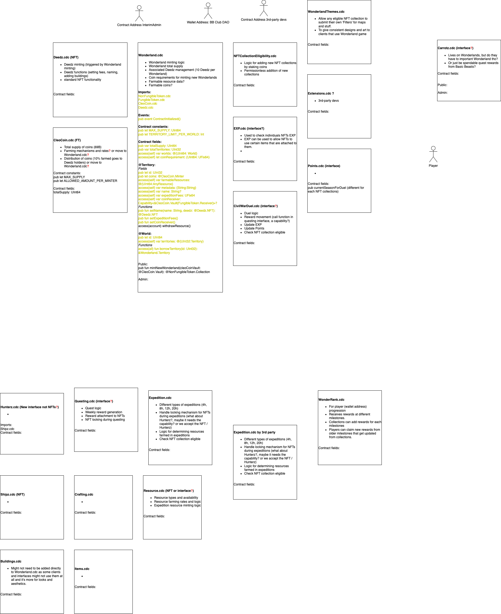

### Update Contracts

```
flow accounts update-contract ./cadence/contracts/BasicBeastsNFTStaking.cdc --network testnet --signer testnet-account
```

### Deploy Contracts on Emulator

#### Step 1

```
flow emulator
```

#### Step 2

```
flow project deploy --network emulator
```

### Deploy Contracts on Testnet

```
flow project deploy --network testnet
```

Notice:
Stable Cadence may introduce breaking changes which require all the smart contracts to be updated accordingly


